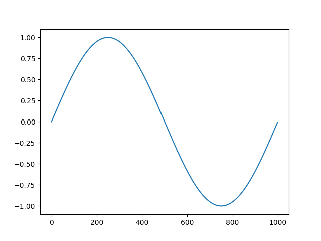
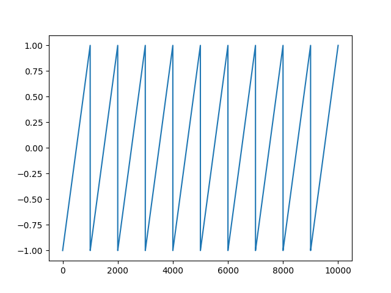
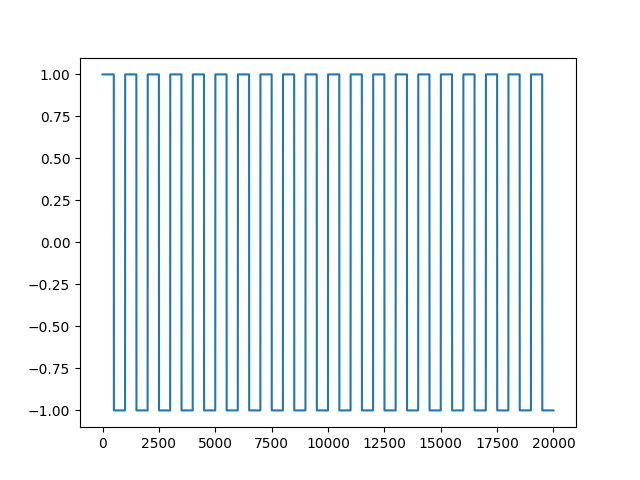

# funcGen.py


### Código fuente

Se ha agregado una nueva función senoidal acorde a lo especificado en términos de argumentos:

```python
def senoidal(f0,fs,N):
    """ Usage example plt.plot(senoidal(0.1*1e3,1e3,100));plt.show() """
    x = np.arange(0,N/fs,1/fs)
    y = np.sin(2*pi*x)
    return y

```

### Ejemplos

```python
import funcGen as x

fs =1000
N  =1000

A=x.senoidal(0.1*fs,fs,N)
B=x.senoidal(1.1*fs,fs,N)

plt.plot(A)
plt.plot(B)
plt.show()


sum(A-B) #si da distinto de cero son distintas


```



```python
x.plt.plot(x.senoidal(1.1*fs,fs,N));x.plt.show()
```



```python
plt.plot(sigSquare(1e3,20));plt.show()
```

