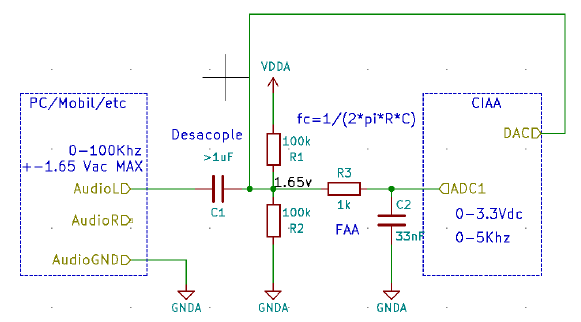
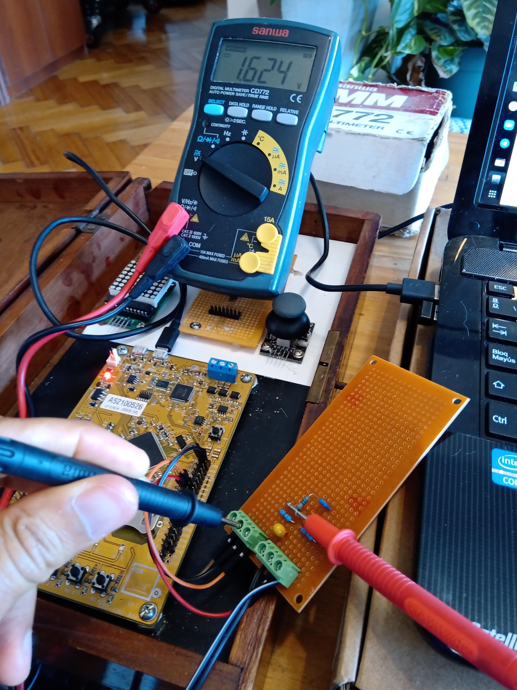
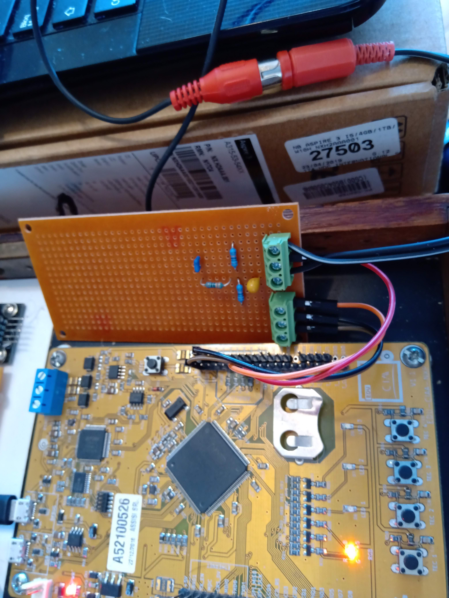

# Setup con CIAA

El circuito implementado es el que se describe en el enunciado, y se presenta en la siguiente figura:





En las siguientes fotografías se puede ver la implementación en una placa experimental.  En la primer foto se muestra la medición del nodo de entrada al filtro antialiasing, y en la segunda la conexión con el jack de audio rojo.






El filtro antialiasing utilizado tiene valores RC levemente distintos debido a disponibilidad de componentes. El capacitor disponible dentro del rango era de 100nF, por lo tanto se resolvió que si el diseño original tenía R3=1K, C2=33nF dando una constante $1/RC = 30.3\ \textrm{K}$ entonces tomando C2=100nF resultaría $1/(30.3K\cdot 100nF) = 330 \Omega = R$ , resultando finalmente R3=330 y C2=100nF.


## Capturas

Se ejecutó el código de prueba "psf.c" usando el firmware_v3 y se levantaron las tramas directamente desde python usando el visualizador "visualize.py". En la siguiente captura se pueden ver algunos resultados al correr un track de audio.


Algo que también se observó es que al desconectar la salida de audio de la PC, la respuesta cambiaba a una senoidal más visible que se atenuaba a los pocos segundos:


## Códigos fuente

Los códigos utilizados son los provistos por la cátedra, con minúsculas modificaciones que sirvieron para correr sobre el setup disponible. En particular se modificaron parámetros del puerto serie.

### psf.c

```c
#include "sapi.h"
#include "arm_math.h"

uint32_t tick	= 0   ;
uint16_t tone	= 100 ;
uint16_t B		= 2000;
uint16_t sweept = 5;

struct header_struct {
   char		pre[8];
   uint32_t id;
   uint16_t N;
   uint16_t fs ;
   char		pos[4];
} header={"*header*",0,128,10000,"end*"};

void trigger(int16_t threshold)
{
   while((adcRead(CH1)-512)>threshold)
	  ;
   while((adcRead(CH1)-512)<threshold)
	  ;
   return;
}

int main ( void ) {
   uint16_t sample = 0;
   int16_t adc [ header.N ];
   boardConfig (				  );
   uartConfig  ( UART_USB, 460800 );
   adcConfig   ( ADC_ENABLE		  );
   dacConfig   ( DAC_ENABLE		  );
   cyclesCounterInit ( EDU_CIAA_NXP_CLOCK_SPEED );
   while(1) {
	  cyclesCounterReset();
	  adc[sample] = (int16_t )adcRead(CH1)-512;					 // va de -512 a 511
	  uartWriteByteArray ( UART_USB ,(uint8_t* )&adc[sample] ,sizeof(adc[0]) );
	  float t=((tick%(sweept*header.fs))/(float)header.fs);
	  tick++;
	  dacWrite( DAC, 512*arm_sin_f32 (t*B/2*(t/sweept)*2*PI)+512); // sweept
	  //dacWrite( DAC, 512*arm_sin_f32 (t*tone*2*PI)+512);		 // tono
	  if ( ++sample==header.N ) {
		 gpioToggle ( LEDR ); // este led blinkea a fs/N
		 sample = 0;
//		 trigger(2);
		 header.id++;
		 uartWriteByteArray ( UART_USB ,(uint8_t*)&header ,sizeof(header ));
		 adcRead(CH1); //why?? hay algun efecto minimo en el 1er sample.. puede ser por el blinkeo de los leds o algo que me corre 10 puntos el primer sample. Con esto se resuelve.. habria que investigar el problema en detalle
	  }
	  gpioToggle ( LED1 );											 // este led blinkea a fs/2
	  while(cyclesCounterRead()< EDU_CIAA_NXP_CLOCK_SPEED/header.fs) // el clk de la CIAA es 204000000
		 ;
   }
}
```

### visualize.py

```python
#!python3
import numpy as np
import matplotlib.pyplot as plt
from   matplotlib.animation import FuncAnimation
import os
import io
import serial

SERIAL_PORT="/dev/ttyUSB1"
header = { "mark": b"*header*", "id": 0, "N": 128, "fs": 10000 }
fig    = plt.figure      ( 1          )

adcAxe = fig.add_subplot ( 2,1,1       )
adcLn, = plt.plot        ( [],[],'r-',linewidth=4  )
adcAxe.grid              ( True        )
adcAxe.set_ylim          ( -1.65 ,1.65 )

fftAxe = fig.add_subplot ( 2,1,2      )
fftLn, = plt.plot        ( [],[],'b-',linewidth=4 )
fftAxe.grid              ( True       )
fftAxe.set_ylim          ( 0 ,0.25 )

def findHeader(f,h):
    index = 0
    sync  = False
    while sync==False:
        data=b''
        while len(data) <1:
            data = f.read(1)
        logFile.write(data)
        if data[0]==h["mark"][index]:
            index+=1
            if index>=len(h["mark"]):
                sync=True
        else:
            index=0
    h["id"] = readInt4File(f,4)
    h["N" ] = readInt4File(f)
    h["fs"] = readInt4File(f)
    print(h)
    return h["id"],h["N"],h["fs"]


def readInt4File(f,size=2,sign=False):
    raw=b''
    while(len(raw)<size):
        data=f.read(1)
        raw+=data
        logFile.write(data)
    return (int.from_bytes(raw,"little",signed=sign))

def findThresh(f,th,h):
    state=1
    sample=0
    for chunk in range(h["N"]):
        sample=readInt4File(f,sign=True)
        if(state==1):
            if(sample<th):
                state=2
        else:
            if(state==2):
                if(sample>=th):
                    return chunk+1,sample
    return N,sample
                
def flushStram(f,h):
    if(f.name): #pregunto si estoy usando la bibioteca pyserial o un file
        f.flushInput()
    else:
        f.seek ( 2*h["N"],io.SEEK_END)

def update(t):
    global header
    flushStram ( streamFile,header )
    id,N,fs=findHeader ( streamFile,header )
    adc   = np.ndarray(N)
    time  = np.ndarray(N)
    index = 0
    t     = 0
    #index,sample=findThresh(streamFile,0,header)
    for chunk in range(N-index):
        sample   = readInt4File(streamFile,sign = True)
        adc[t]   = sample/512*1.65
        time[t]  = t/fs
        t       += 1

    adcAxe.set_xlim ( 0    ,N/fs )
    adcLn.set_data  ( time ,adc  )

    fft=np.abs ( 1/N*np.fft.fft(adc ))**2
    fftAxe.set_ylim ( 0 ,np.max(fft)+0.05)
    fftAxe.set_xlim ( 0                ,fs/8 )
    fftLn.set_data ( (fs/N )*fs*time ,fft)
    return adcLn, fftLn

#seleccionar si usar la biblioteca pyserial o leer desde un archivo log.bin
#streamFile=open("log.bin","rb",0)
streamFile = serial.Serial(port=SERIAL_PORT,baudrate=460800,timeout=None)

logFile=open("log.bin","wb",0)

ani=FuncAnimation(fig,update,1000,init_func=None,blit=False,interval=1,repeat=True)
plt.draw()
#mng=plt.get_current_fig_manager()
#mng.resize(mng.window.maxsize())
#plt.get_current_fig_manager().window.showMaximized() #para QT5
plt.show()
streamFile.close()
logFile.close()
```

